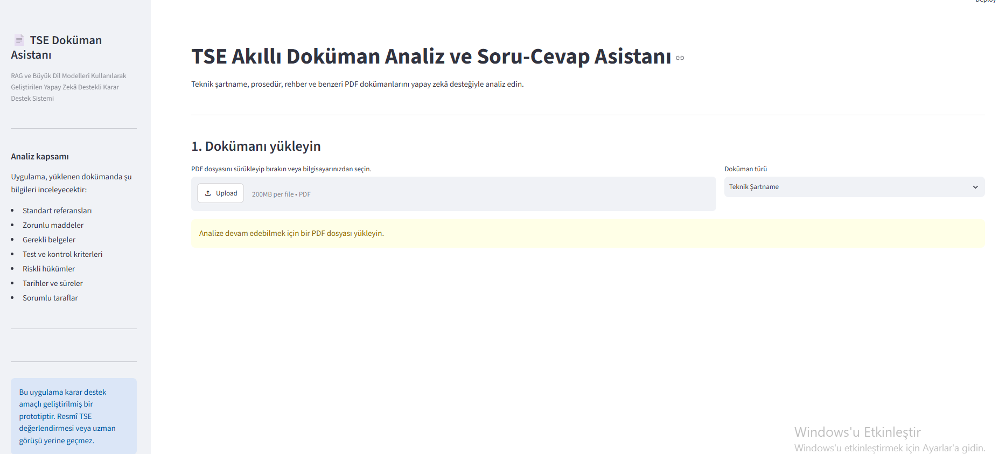
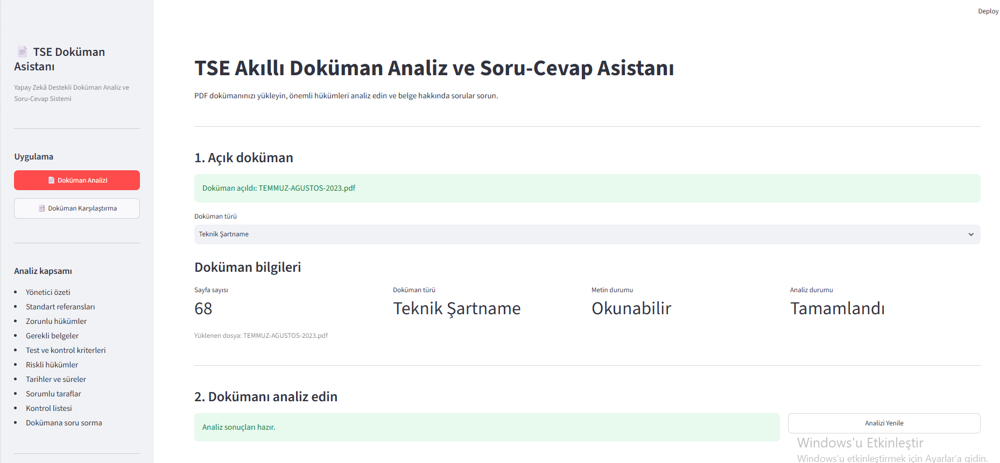

# Smart Document Analysis and Comparison

PDF, Word ve Excel dokümanlarını yapay zekâ destekli olarak analiz etmek ve karşılaştırmak amacıyla geliştirilmiş bir doküman analiz uygulamasıdır.

Uygulama; farklı dosya formatlarındaki metinleri, başlıkları ve tabloları inceleyebilir. Ayrıca iki dokümanı karşılaştırarak aralarındaki farklılıkların kullanıcıya daha anlaşılır şekilde sunulmasını sağlar.

## Özellikler

- PDF dokümanlarını analiz etme
- Word (.docx) dosyalarını analiz etme
- Excel (.xlsx) dosyalarını analiz etme
- Başlık ve alt başlıkları inceleme
- Doküman içerisindeki tabloları okuma
- Yapay zekâ destekli içerik analizi
- İki Word dokümanını karşılaştırma
- İki Excel dosyasını karşılaştırma
- Dokümanlar arasındaki farklılıkları belirleme
- Sonuçları kullanıcı dostu bir arayüzde görüntüleme
- Dosya türüne göre uygun analiz işlemlerini gerçekleştirme

## Kullanılan Teknolojiler

- Python
- Streamlit
- Gemini AI
- Pandas
- OpenPyXL
- python-docx
- PDF işleme kütüphaneleri
- Yapay zekâ destekli metin analizi

## Uygulama Bölümleri

### Doküman Analizi

Kullanıcı PDF, Word veya Excel formatındaki bir dokümanı sisteme yükleyebilir.

Uygulama dosyanın türünü belirleyerek içeriği işler. Dokümanda bulunan metinler, başlıklar, alt başlıklar ve tablolar incelenerek analiz için hazırlanır.

Elde edilen içerik yapay zekâ modeli yardımıyla değerlendirilir ve analiz sonucu kullanıcıya uygulama arayüzü üzerinden sunulur.

### Doküman Karşılaştırma

Doküman Karşılaştırma bölümünde kullanıcı iki dosya yükleyebilir.

Uygulama dokümanların içeriklerini ayrı ayrı inceleyerek aralarındaki farklılıkları belirler.

Bu özellik özellikle Word ve Excel dokümanlarında bulunan içerik değişikliklerinin daha hızlı ve kolay şekilde incelenmesini amaçlamaktadır.

## Projenin Amacı

Kurumsal çalışmalarda PDF, Word ve Excel formatında çok sayıda doküman kullanılmaktadır. Bu dokümanların manuel olarak incelenmesi ve karşılaştırılması zaman alabilmektedir.

Bu proje ile farklı doküman formatlarının tek bir uygulama üzerinden analiz edilmesi ve karşılaştırılması amaçlanmıştır.

Yapay zekâ desteği kullanılarak doküman inceleme süreçlerinin daha hızlı, düzenli ve anlaşılır hale getirilmesi hedeflenmiştir.

## Proje Yapısı

- `app.py` — Uygulamanın ana çalışma dosyası ve Streamlit arayüzü
- `requirements.txt` — Projede kullanılan Python kütüphaneleri
- `README.md` — Proje hakkında açıklamalar

## Kurulum

Projeyi bilgisayarınıza indirdikten sonra gerekli Python paketlerini yükleyin:

    pip install -r requirements.txt

Uygulamanın yapay zekâ özelliklerini kullanabilmesi için gerekli API anahtarını `.env` dosyasında saklayın.

`.env` dosyası güvenlik nedeniyle GitHub reposuna dahil edilmemiştir.

Ardından uygulamayı çalıştırın:

    streamlit run app.py

## Kullanım

1. Uygulamayı çalıştırın.
2. Sol menüden **Doküman Analizi** veya **Doküman Karşılaştırma** bölümünü seçin.
3. Kullanmak istediğiniz dosya türünü belirleyin.
4. PDF, Word veya Excel dosyanızı yükleyin.
5. Analiz veya karşılaştırma işlemini başlatın.
6. Oluşturulan sonuçları uygulama üzerinden inceleyin.

## Güvenlik

API anahtarları ve diğer gizli bilgiler `.env` dosyasında tutulmaktadır.

Güvenlik amacıyla `.env` dosyası GitHub reposuna yüklenmemiştir.

## Gelecek Geliştirmeler

- Daha fazla doküman formatının desteklenmesi
- Doküman karşılaştırma yöntemlerinin geliştirilmesi
- Analiz sonuçlarının rapor olarak dışa aktarılması
- Büyük dokümanlar için daha gelişmiş analiz yöntemlerinin kullanılması
- Tabloların daha ayrıntılı karşılaştırılması
- Kullanıcıya özel analiz seçeneklerinin eklenmesi

## Proje Notu

Bu proje, staj kapsamında verilen bir görev olarak geliştirilmiştir.

## Ekran Görüntüleri

### Ana Uygulama Ekranı

### Doküman Analizi

### Doküman Karşılaştırma

### Dokümana Soru Sorma

### Doküman İçerisinde Arama

### Eklenen Hükümlerin Tespiti

### Değiştirilen Hükümlerin Tespiti

## Örnek Analiz Raporu

Uygulamada gerçekleştirilen analiz işlemlerine ait örnek rapor:

[Örnek Analiz Raporunu Görüntüle](TEMMUZ-AGUSTOS-2023_analiz_raporu.pdf)
